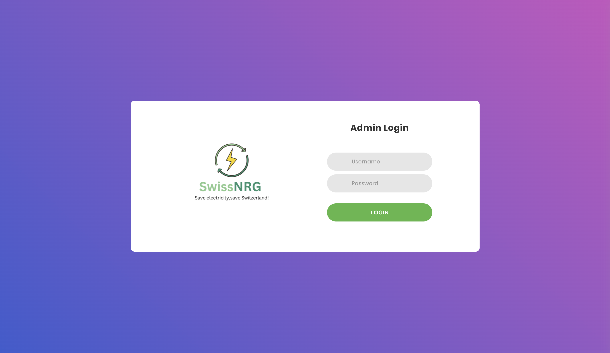
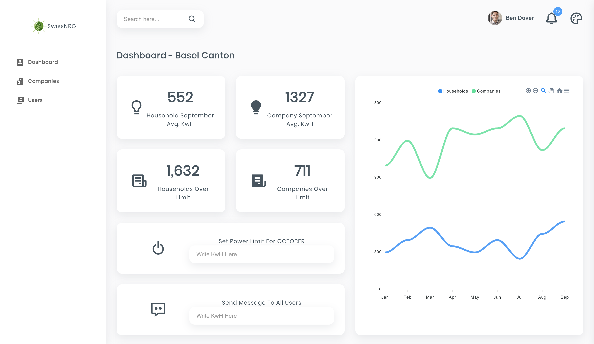
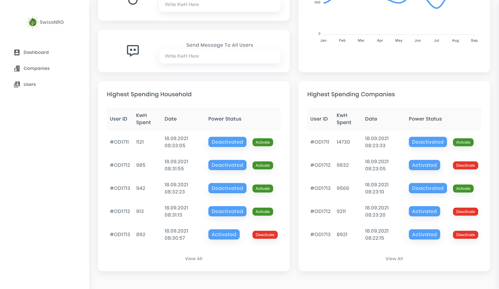
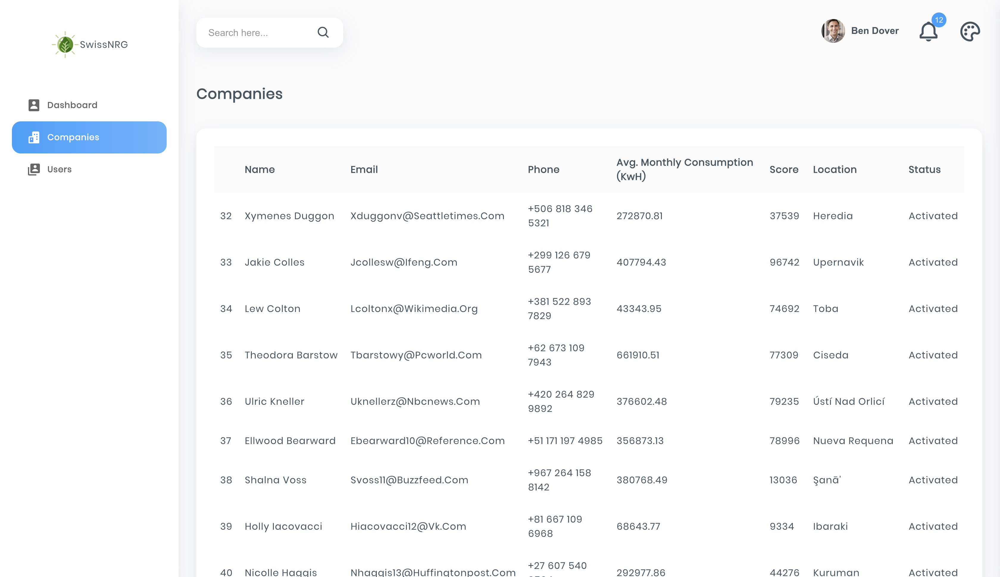
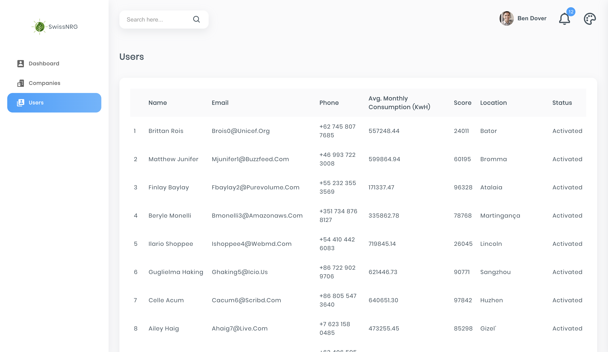

# SwissNRG-Admin

This is an interface that helps the Swiss cantonal authorities, manage the electrical distribution to the household or company owners. 

Through this demo interface, the administrator will have to put how much energy they can use per each month. Then the user through their <a href="https://github.com/siborax/HackZurichFrontEnd">iOS app</a>, will get a recommended limit of how much energy they can spend, that is calculated based on how much energy can be spent on that canton that month + their previous data of how much they have spent previously. If the user does not have any previous data, then how many family members and house size in square meters, will need to be provided when creating an account. 

Another feature is that, if the user misuses the energy, which means that they exceed their daily limit by x5 or x10, their energy supply gets cut off automatically from the backend. And only the administrator will be able to activate it again! 

With this web interface you can also write a message that can be sent as a notification on all smartphones, on scenarios where you have to notify users for an upcoming blackout, or any news!

# How to install it?

1. Firstly check if you have nodejs installed:
```
node -v
```

If you get the version then you can proceed with next instructions, otherwise you have to install it based on your OS environment.

2. Open the terminal and on some directory, clone the project:

```
git clone https://github.com/selaudin/SwissNRG-Admin.git
```

3. Change the directory:
```
cd SwissNRG-Admin/
```

4. Install the required packages with npm
```
npm install
```

4. After a successful installation, you can run the website:
```
npm run
```

# Routes

### /



### /Dashboard




### /Companies


### /Users


